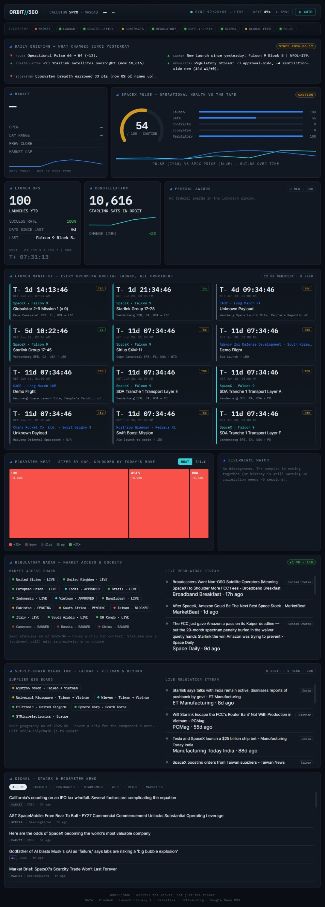

<div align="center">

# ORBIT//360

**A single-pane flight-ops console for SpaceX (`SPCX`) and its public-market ecosystem.**

Open it in the morning and know, at a glance, what's happening across the whole
complex — financial *and* operational.

[](https://github.com/lordpixma/orbit360/actions/workflows/ci.yml)
[](LICENSE)
[](https://workers.cloudflare.com/)




<sub>The live board — operational health, launches, the constellation, contracts, and the regulatory &amp; supply-chain radars, all on one screen.</sub>

</div>

> **Thesis:** every dashboard monitors the stock. SpaceX's real fundamentals are
> *physical* — launches, satellites, contracts, regulation, supply chains — and
> observable in public data no terminal tracks. **So we monitor the rocket, not
> just the ticker.**

Orbit360 is a [Cloudflare Worker](https://workers.cloudflare.com/) that fetches
from a handful of free public APIs, fuses them into one snapshot, and serves a
zero-build, vanilla-JS dashboard. A cron polls every 10 minutes, accumulates
history in Workers KV, and emails you when something significant happens. **It
has zero runtime dependencies.**

---

## Table of contents

- [The dashboard, panel by panel](#the-dashboard-panel-by-panel)
- [Console controls & behaviour](#console-controls--behaviour)
- [How it works](#how-it-works)
- [Data sources](#data-sources)
- [The SpaceX Pulse](#the-spacex-pulse)
- [The regulatory radar](#the-regulatory-radar)
- [The supply-chain migration watch](#the-supply-chain-migration-watch)
- [The daily briefing](#the-daily-briefing)
- [Project structure](#project-structure)
- [Getting started (deploy in ~10 minutes)](#getting-started-deploy-in-10-minutes)
- [Local development](#local-development)
- [Configuration reference](#configuration-reference)
- [The global feed (non-US names)](#the-global-feed-non-us-names)
- [Testing](#testing)
- [Honest build notes & known limitations](#honest-build-notes--known-limitations)
- [Roadmap](#roadmap)
- [Contributing](#contributing)
- [License](#license)

---

## The dashboard, panel by panel

The board is a responsive 12-column grid on a dark "mission-control" theme. Top
to bottom, here is exactly what it renders.

### Header — status strip

A persistent top bar:

- **`ORBIT//360`** wordmark and **`CALLSIGN SPCX · NASDAQ`**.
- The **live SPCX price** and its **colour-coded change %** (green up / red down).
- A sync cluster on the right: a **`STALE`** badge (only when showing held-over
  data), a pulsing **live dot**, the last sync time and mode
  (`SYNC HH:MM:SS · LIVE | STALE | SAMPLE`), a **countdown to the next auto-sync**
  (`NEXT 42s`), a manual **↻ Sync** button, and a **⏸ Auto** pause/resume toggle.

### Telemetry status bar

A row of per-feed health chips, each **nominal / degraded / offline** with a
coloured indicator, so you can see at a glance which source is struggling while
the rest of the board keeps working:

`MARKET · LAUNCH · CONSTELLATION · CONTRACTS · REGULATORY · SUPPLY-CHAIN · SIGNAL · PULSE`

(plus **`GLOBAL FEED`** when the optional Twelve Data feed has names pending).
Hover any chip for the detail (e.g. *"91 launches YTD"*, *"8,912 sats tracked"*).

### 1 · Daily briefing — *what changed since yesterday* (full width)

A day-over-day diff of every metric, in plain language, at the very top of the
board. A pill reads **`SINCE <date>`** (or **`BASELINE`** on day one). When the
optional AI narrative is enabled, a 2–3 sentence prose summary sits above a
two-column grid of change items, each with a tone icon (**▲** up, **▼** down,
**!** warning, **◆** info, **—** flat) and a label: *SPCX, Pulse, Constellation,
Contracts, Regulatory, Supply chain, Ecosystem*. See [The daily briefing](#the-daily-briefing).

### 2 · Market (Finnhub)

The hero financial panel: big **SPCX price**, the absolute and percentage
**change**, then **OPEN**, **DAY RANGE**, **PREV CLOSE**, and **MARKET CAP**.
A mini **SPCX-trend sparkline** sits underneath and builds up over time.

### 3 · SpaceX Pulse — *operational health vs the tape* (computed)

The signature panel. A semicircular **gauge** shows a single **0–100
operational-health score** with a band label (**NOMINAL / CAUTION / CRITICAL**),
colour-coded. Beside it, **component bars** break the score into its inputs
(Launch, Sats, Ecosystem, Contracts, Regulatory). Below, a **dual sparkline**
plots the **Pulse (cyan)** against the **SPCX price (blue)** so you can *see the
divergence* when operations and the market disagree. See
[The SpaceX Pulse](#the-spacex-pulse).

### 4 · Launch ops (Launch Library 2)

The company's heartbeat: big **launches-YTD**, plus **SUCCESS RATE**, **DAYS
SINCE LAST**, and the **LAST** mission name. A divider separates the **NEXT**
mission + pad and a **live T-minus countdown** that ticks every second (turning
cyan inside T-1h).

### 5 · Constellation (CelesTrak)

A big count of **Starlink satellites currently in orbit**, a sparkline of the
recent daily trajectory, and the **24h delta** (more satellites = more network
capacity = the ceiling on Starlink revenue).

### 6 · Federal awards (USASpending)

A pill shows **`N NEW · 30D`**. Below, the most recent federal awards to SpaceX —
each line is *agency · description → amount* (new NASA / Space Force / NRO awards
lead reported revenue).

### 7 · Launch manifest — *every upcoming orbital launch, all providers* (full width)

"Monitor the rocket" taken literally. A pill reads **`N ON MANIFEST · M <24H`**,
above a responsive grid of **launch tiles** — worldwide, every provider. Each
tile shows a **status badge** (GO / HOLD / FAIL / TBC / TBD), a big **live
T-minus countdown** (flips to **T+** just after liftoff), the **NET** date/time,
**provider · rocket**, the **mission**, and **site → orbit**. The coloured left
edge flags context: **cyan = SpaceX**, **amber = launching within the hour**,
**green = just lifted off**. Every countdown ticks every second.

### 8 · Ecosystem heat — *sized by cap, coloured by today's move* (Finnhub / Twelve Data)

A **Heat / Table** toggle (your choice persists):

- **Heat** — a squarified **treemap** of the ecosystem, each tile sized by
  market cap (square-root-scaled so mega-caps don't swallow the map) and coloured
  on a red→grey→green scale by today's % move. Hover for the full detail: name,
  ticker, **tier**, cap, move, and the **linkage** note explaining *why* the name
  is connected to SpaceX. A legend spans −3%+ → +3%+.
- **Table** — a sortable table (**Symbol · Cap · Chg% · ρ SPCX**) that also
  surfaces the small and global names too tiny to render on the treemap. Each row
  carries a tier tag and the linkage on hover; click any header to sort.

### 9 · Divergence watch (computed)

Names that *usually* track SPCX (Pearson **|ρ| ≥ 0.5** over accumulated daily
closes) but **broke ranks today** — each row shows the symbol, its correlation,
and today's move. These are the "worth a look" signals. Correlation warms up over
~5 sessions as the cron accumulates history.

### 10 · Regulatory radar — *market access & dockets* (keyless RSS)

Two columns, with a **`▲pos ▼neg · 14D`** pill:

- **Market-access board** — country chips coloured by status (**live /
  approved / pending / blocked / banned**); hover for the note. Honestly labelled
  with its as-of date.
- **Live regulatory stream** — headlines tagged with a **direction** (▲
  approval-side / ▼ restriction-side / ● neutral) and a **country**, with source
  and time-ago, linking out.

See [The regulatory radar](#the-regulatory-radar).

### 11 · Supply-chain migration — *Taiwan → Vietnam & beyond* (keyless RSS)

Two columns, with a **`N SHIFT ▸ M RISK · 30D`** pill:

- **Supplier geo board** — chips reading *supplier · from→to*, coloured by status
  (**migrating / diversifying / stable / risk**); hover for the component & note.
- **Live relocation stream** — headlines tagged with a **kind** (▲ shift / ▼ risk
  / ● note) and an **origin→destination route**, with source and time-ago.

See [The supply-chain migration watch](#the-supply-chain-migration-watch).

### 12 · Signal — *SpaceX & ecosystem news* (Finnhub)

A filterable news feed. **Category chips** (All · Launch · Contract · Starlink ·
AI · Reg · Market) carry live counts; the scrollable feed shows each headline
with a category tag, source, and time-ago, linking out. Tagging is by *what
drives price*, so you can isolate, say, just the contract or regulatory flow.

### Footer

The tagline — *"monitor the rocket, not just the ticker"* — and the data-source
credits line.

---

## Console controls & behaviour

All client-side; no backend changes needed.

- **Auto-sync** every 60s. Polling **auto-pauses when the tab is hidden** (to
  spare your API quota) and refreshes the instant you return.
- **Manual sync** (the **↻ Sync** button or **`R`**) and a **pause/resume**
  toggle (the **⏸ Auto** button or **`P`**), with a live countdown to the next sync.
- **Graceful degradation, three states.** If a refresh fails *after* the board
  was live, it **holds the last-good live data** and flags it **`STALE`** rather
  than blanking. **Sample/preview mode** is used only before any live data has
  arrived — which also makes `public/index.html` openable on its own for UI work.
- **Per-second countdowns** on the next-launch T-minus and every manifest tile.
- **Preferences persist** in `localStorage` (heat/table view, news filter).
- Respects `prefers-reduced-motion`.

---

## How it works

```
                         ┌──────────────────────────────────────────┐
  Browser  ── GET /  ──▶ │  Cloudflare Worker (src/index.js)         │
           ◀─ SPA  ──    │                                          │
                         │  fetch():                                 │
  Browser ─ GET /api ──▶ │   /api/dashboard → cached snapshot (KV)   │
           ◀─ JSON ──    │   /api/health    → liveness              │
                         │   *              → static assets (SPA)    │
                         │                                          │
   cron (*/10) ───────▶  │  scheduled():                             │
                         │   build snapshot ─┐                       │
                         └───────────────────┼───────────────────────┘
                                             │  (all feeds in parallel,
                          ┌──────────────────┴───────────────────┐    each degrades on its own)
                          ▼          ▼          ▼         ▼        ▼
                       Finnhub   Launch Lib 2  CelesTrak  USASpend  Google News RSS
                          │          │          │         │        │
                          └──────────┴────┬─────┴─────────┴────────┘
                                          ▼
                              Workers KV  (snapshot + history + alert state)
                                          │
                                          ▼
                              Email alert (Cloudflare Email Routing)
```

- **`fetch(request, env, ctx)`** serves three things: `GET /api/dashboard` returns
  the aggregate snapshot the UI reads (JSON, `no-store`); `GET /api/health`
  returns `{ ok, hasFinnhub, ts }`; everything else serves the static dashboard
  from the `ASSETS` binding.
- **`scheduled(event, env, ctx)`** runs on the cron: rebuild the snapshot → write
  it to KV → roll the daily close/pulse/digest **history** → (optionally) generate
  the AI narrative → **fire email alerts** for fresh, de-duplicated events.
- **Caching.** The snapshot is cached in KV (`snapshot:latest`) and the UI accepts
  it for 90 seconds before triggering an on-demand rebuild. Each data layer adds
  its own KV cache (quotes ~60s, news ~10min, profiles ~24h, launches ~30–60min,
  constellation ~6h, contracts ~12h, RSS ~30–60min), so neither the dashboard nor
  the cron ever hammers an upstream API.
- **Resilience.** Every fetcher is wrapped to **retain its last-good payload** (or
  fall back to an empty state) on failure — a degraded feed never errors the
  build or blanks a card.

---

## Data sources

All free; only Finnhub (and optionally Twelve Data) needs a key.

| Source | Used for | Key? |
|---|---|---|
| [Finnhub](https://finnhub.io/) | US-listed quotes, market cap, SpaceX & ecosystem news | **Yes** (free tier, 60 calls/min) |
| [Twelve Data](https://twelvedata.com/) | Non-US quotes (LSE, TWSE, KOSDAQ, TSX, Euronext, Milan) | Optional |
| [Launch Library 2](https://thespacedevs.com/) (The Space Devs) | Launch ops + global launch manifest | No (keyless `lldev` mirror by default) |
| [CelesTrak](https://celestrak.org/) | Live Starlink satellites in orbit | No |
| [USASpending](https://api.usaspending.gov/) | Federal awards to SpaceX | No |
| Google News RSS | Regulatory radar + supply-chain migration streams | No |
| [Cloudflare Email Routing](https://developers.cloudflare.com/email-routing/) | Native email alerts | No (account feature) |
| [Cloudflare Workers AI](https://developers.cloudflare.com/workers-ai/) | Optional briefing narrative | No (off by default) |

The ecosystem basket lives in [`src/tickers.js`](src/tickers.js), where every
name is tagged by **tier** — `subject` (SpaceX), `direct` (supplier / financial
tie), `partner` (revenue-linked), `pureplay` (space competitor), `legacy`
(aerospace prime), `ai` (xAI-merger exposure) — and a one-line **linkage**
explaining *why* it moves with SpaceX.

---

## The SpaceX Pulse

A transparent, tunable weighted score (the weights live in
[`src/pulse.js`](src/pulse.js)), built **only from operations** — deliberately
*not* from the SPCX price, so the two can be plotted against each other.

| Signal | Weight | What it measures |
|---|---|---|
| Launch momentum | 0.30 | cadence (target ~12 launches/30d) blended with success rate |
| Constellation growth | 0.25 | net satellites added since the last sample |
| Ecosystem breadth | 0.20 | share of connected names trading up today |
| Contract activity | 0.15 | new federal awards in the last 30 days |
| Regulatory balance | 0.10 | 14-day approvals vs restrictions (neutral 0.5 when quiet) |

Weights **renormalise over whatever feeds report**, so a missing source never
breaks the score — it just relies on the rest. Bands: **≥70 nominal · 40–69
caution · <40 critical**. Alongside the score, the Worker computes the **Pearson
correlation** of each ecosystem name against SPCX over accumulated daily closes,
and flags **divergences** (|ρ| ≥ 0.5 but moved the opposite way today).

---

## The regulatory radar

Keyless by design. Targeted Google News RSS queries (in
[`src/regulatory.js`](src/regulatory.js)) cover FCC dockets and international
licensing news; each headline is auto-tagged with a **country** (regulator names
like ICASA / Anatel / TRAI are recognised) and a **direction** — ▲ approval-side,
▼ restriction-side. The 14-day ▲/▼ balance feeds the Pulse, and clear
approvals/restrictions from the last 24h fire email alerts.

The **market-access board** ([`src/markets.js`](src/markets.js)) is seed data,
honestly labelled with its as-of date on the dashboard. The stream informs it,
but status changes are a judgement call — edit the file and redeploy. Add
national-regulator RSS feeds to `SOURCES` any time; one dead feed never takes
down the radar.

---

## The supply-chain migration watch

SpaceX's physical fundamentals include *where the hardware is built*. The company
has pushed Starlink suppliers — notably Taiwanese terminal makers — to add
capacity outside Taiwan on geopolitical-risk grounds, with **Vietnam** the main
destination. That shift shows up in trade/industry news long before it reaches
anywhere financial, so [`src/supplychain.js`](src/supplychain.js) tracks it the
same keyless way as the radar:

- **Supplier geo board** (`SUPPLY_BOARD`) — seed geography for each key supplier
  (`from → to`, status `migrating` / `diversifying` / `stable` / `risk`).
- **Live relocation stream** — RSS headlines filtered to physical-supply items,
  then tagged with origin/destination and a kind: ▲ `shift`, ▼ `risk`, or ● note.
  The 30-day shift/risk tally drives the pill; fresh items fire alerts.

---

## The daily briefing

[`src/briefing.js`](src/briefing.js) stores a compact **daily digest** of the
board's headline metrics in KV and diffs today against the most recent prior day,
emitting plain-language change items (SPCX move, Pulse delta + band change,
overnight satellites, new launches/awards, regulatory swing, supply-chain shifts,
ecosystem breadth). It is **deterministic and always on** — it only ever states
computed deltas, so it can't hallucinate, and it shows *"No material change"* on a
genuinely quiet day. It warms up after the first day of history accrues.

An **optional AI narrative** turns those same facts into a 2–3 sentence morning
brief. It's **off by default**; enable it by uncommenting the `[ai]` binding in
`wrangler.toml` (native **Cloudflare Workers AI** — no API key, generous free
allotment). The model is fed *only* the computed facts, the result is cached per
day, and if it's absent or errors the deterministic bullets stand on their own.

---

## Project structure

```
orbit360/
├── public/
│   └── index.html        # the entire dashboard SPA (vanilla JS, no build step)
├── src/
│   ├── index.js          # Worker entry: /api routes + the scheduled() cron
│   ├── tickers.js        # the ecosystem basket (symbols, tiers, linkage, feed)
│   ├── finnhub.js        # US quotes + news + news classification
│   ├── twelvedata.js     # non-US quotes (optional)
│   ├── spacedata.js      # Launch Library 2: launch ops + global manifest
│   ├── contracts.js      # USASpending federal awards
│   ├── regulatory.js     # keyless regulatory radar (RSS)
│   ├── markets.js        # market-access seed board + country detection
│   ├── supplychain.js    # keyless supply-chain migration watch (RSS)
│   ├── pulse.js          # operational-health score + correlation/divergence
│   ├── briefing.js       # "what changed since yesterday" digest + diff
│   ├── alerts.js         # native Cloudflare email alerts
│   └── rss.js            # tiny dependency-free RSS parser + helpers
├── test/                 # node:test unit tests (one file per module)
├── wrangler.toml         # Worker config: bindings, cron, vars
└── .dev.vars.example     # template for local secrets
```

---

## Getting started (deploy in ~10 minutes)

You'll need a (free) [Cloudflare account](https://dash.cloudflare.com/sign-up), a
(free) [Finnhub API key](https://finnhub.io/register), and the
[Wrangler](https://developers.cloudflare.com/workers/wrangler/) CLI.

```bash
git clone https://github.com/lordpixma/orbit360.git
cd orbit360
npx wrangler login
```

**1 · Create the KV store** and paste the id it prints into `wrangler.toml`
(replace the `<your-kv-namespace-id>` placeholder):

```bash
npx wrangler kv namespace create ORBIT_KV
```

**2 · Add your Finnhub key** (stored encrypted as a secret, never committed):

```bash
npx wrangler secret put FINNHUB_API_KEY
```

**3 · Turn on email alerts** (optional but recommended):

- In the Cloudflare dashboard: **Email → Email Routing**, enable it on a domain
  you own.
- Add your inbox under **Destination Addresses** and click the verification link.
- In `wrangler.toml`, set `destination_address`, `ALERT_TO` (the same verified
  address), and `ALERT_FROM` (any address on that domain).

**4 · Ship it:**

```bash
npx wrangler deploy
```

That's it — the cron polls every 10 minutes, caches to KV, and emails you when
something significant happens.

---

## Local development

```bash
cp .dev.vars.example .dev.vars   # paste your Finnhub key
npx wrangler dev
```

No key (or no Wrangler)? Just open `public/index.html` — the dashboard renders in
**preview mode** with representative sample telemetry, ideal for UI work.

---

## Configuration reference

Set in **`wrangler.toml`** (committed, non-secret):

| Setting | Purpose |
|---|---|
| `[[kv_namespaces]] ORBIT_KV` | Snapshot cache + accumulated history + alert dedupe state |
| `[assets] ASSETS` | Serves the static dashboard from `public/` |
| `[[send_email]] SEND_EMAIL` + `destination_address` | Native email-alert binding |
| `[triggers] crons` | Poll/alert cadence (default `*/10 * * * *`) |
| `vars.ALERT_FROM` / `vars.ALERT_TO` | Alert sender / recipient (recipient must be verified) |
| `[ai] AI` *(commented out)* | Uncomment to enable the optional AI briefing narrative |

Set as **secrets** (`wrangler secret put NAME`, encrypted, never in the repo):

| Secret | Required? | Purpose |
|---|---|---|
| `FINNHUB_API_KEY` | **Yes** | US quotes, market cap, news |
| `TWELVEDATA_API_KEY` | Optional | Activates the non-US (global) names |
| `LL2_API_KEY` | Optional | Switches Launch Library 2 to the fresher production host |

For local dev, the same keys go in **`.dev.vars`** (git-ignored — see
`.dev.vars.example`).

---

## The global feed (non-US names)

Filtronic, Sphere, Wistron NeWeb, Eutelsat, Airbus, Avio and MDA come via
[Twelve Data](https://twelvedata.com) — already wired in
[`src/twelvedata.js`](src/twelvedata.js). Activate with:

```bash
npx wrangler secret put TWELVEDATA_API_KEY
```

One batched quote call covers all seven names (7 credits), cached 15 minutes —
~670 credits/day against the free tier's 800. Two caveats, stated plainly:

- **Symbol mappings** (`td:` in `src/tickers.js`, `SYMBOL:EXCHANGE` form) follow
  Twelve Data's documented notation but weren't verified live. If a name shows
  "pending", check it against
  `https://api.twelvedata.com/symbol_search?symbol=<name>` and adjust.
- **Exchange access**: Twelve Data gates some non-US exchanges (notably Korea and
  Taiwan) to paid plans. A gated name fails per-symbol and shows as pending — the
  rest of the board is unaffected.

Twelve Data's quote endpoint carries no market cap, so treemap sizing for global
names uses the editable `approxCapUSD` values in `src/tickers.js`.

---

## Testing

A zero-dependency unit-test suite runs on Node's built-in test runner (Node 18+):

```bash
npm test                       # run everything
node --test test/pulse.test.js # run a single file
```

It covers the pure logic that doesn't need the network or the Workers runtime —
the Pulse scoring and correlation/divergence math, the RSS parser, Twelve Data
quote mapping, news classification, the regulatory and supply-chain heuristic
taggers, and the briefing diff. CI runs the same suite on every push and PR. See
[CONTRIBUTING.md](CONTRIBUTING.md) for the development workflow.

---

## Honest build notes & known limitations

- **Two feeds resist Cloudflare's edge specifically** (both work fine from a
  normal IP — which is exactly why every feed degrades gracefully with last-good
  retention):
  - **Constellation (CelesTrak)** soft-rate-limits per IP and answers the shared
    egress IP with a 403 *"GP data has not updated"*. The count seeds whenever a
    request catches an un-throttled window, then sticks.
  - **Federal Awards (USASpending)** sometimes answers Worker subrequests with
    **HTTP 525**. `src/contracts.js` retries with a bounded timeout (so it never
    stalls the build) and briefly caches the failure; the card fills when the edge
    is served.
- **Launch Library 2 rate-limits its production host (`ll`) to ~15 req/hr**, and
  Cloudflare's *shared* egress IP hits that ceiling collectively. So
  `src/spacedata.js` defaults to The Space Devs' **free, keyless dev mirror**
  (`lldev.thespacedevs.com`) — same schema, far more lenient, slightly less fresh.
  On top of that, LL2 calls are funnelled through a single-file queue (300 ms gap),
  the first 429 parks all calls in a ~20-min KV backoff, and both feeds retain
  their last-good data through a failure. Set `LL2_API_KEY` to use the fresher
  production host (the limit is then per-account).
- **Google News RSS** is an unofficial-but-stable interface; if it ever changes
  shape, the radars degrade to empty rather than erroring. Keyword
  direction/geo-tagging is heuristic — expect the occasional mislabel; the
  headline text is always shown so you can judge for yourself.
- **Correlation and the Pulse-vs-price chart warm up** over a few sessions, since
  they accumulate daily closes in KV as the cron runs.
- All feeds are written to each provider's **documented** request/response shape;
  run `npx wrangler tail` on first deploy to spot any field-name drift.

---

## Roadmap

- [x] Supply-chain geo-migration watch (Taiwan → Vietnam) — `src/supplychain.js`
- [x] Optional AI "what changed since yesterday" briefing — `src/briefing.js`
- [ ] Persist the digest/briefing history to a queryable timeline view
- [ ] National-regulator RSS feeds beyond Google News for the radar
- [ ] More ecosystem names as new pure-plays go public

---

## Contributing

Contributions are welcome — see [CONTRIBUTING.md](CONTRIBUTING.md) for the layout,
the local loop, and the conventions (chiefly: **zero runtime dependencies** and
**every feed degrades gracefully**). Security policy is in [SECURITY.md](SECURITY.md).

## License

[MIT](LICENSE) © Samuel Odekunle
